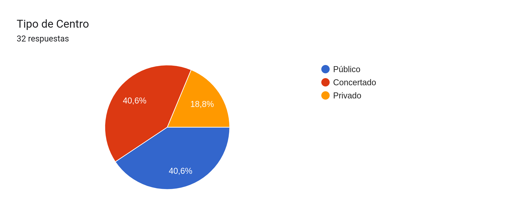
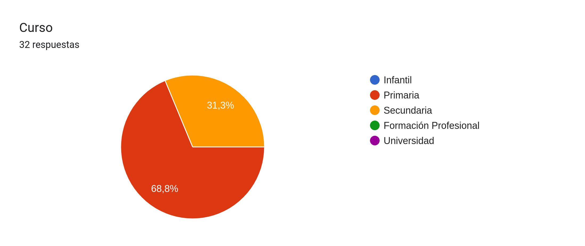
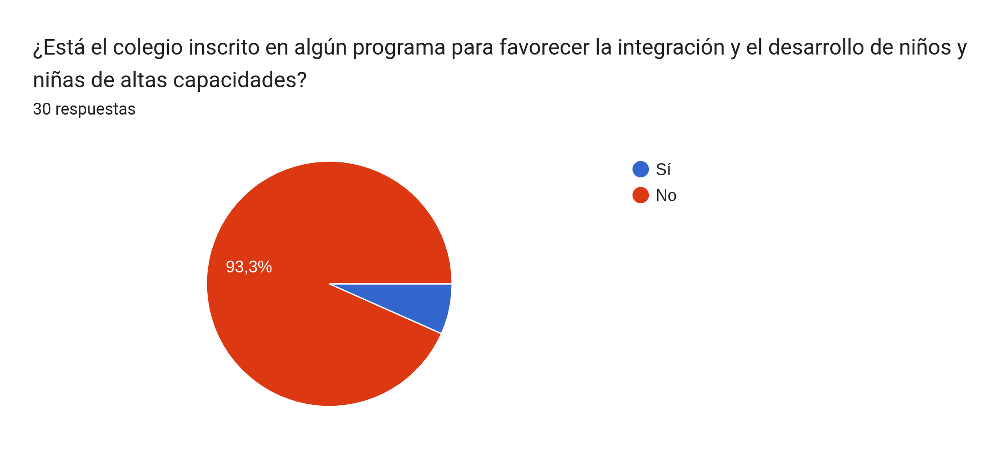
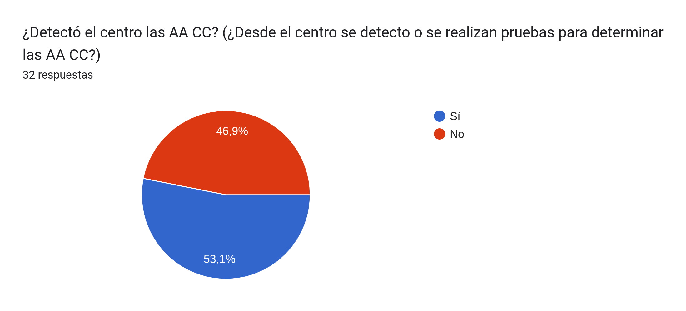
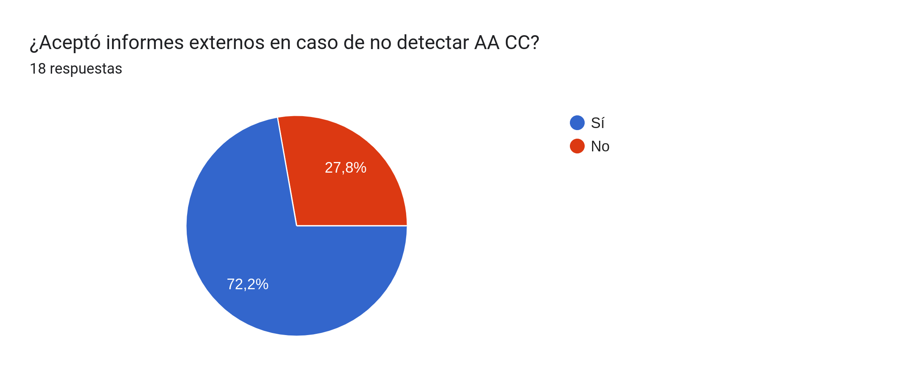
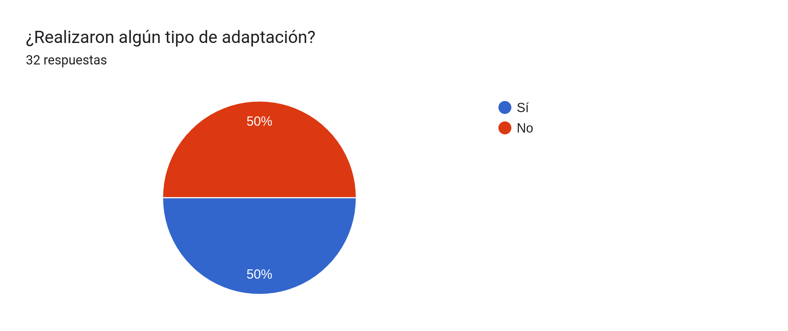
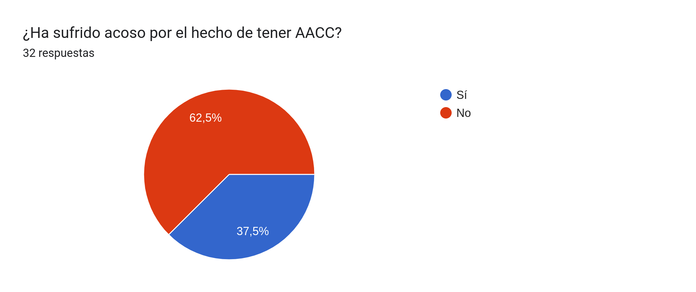

Como os presentamos en la [Encuesta sobre centros](), y gracias a que ya se ha ido rellenando por vuestra parte, podemos ir sacando algunas primeras lecturas de los datos recibidos.


Tened en cuenta que el número de respuestas es todavía muy bajo, por lo que hay que ser cauteloso con el análisis.


Tipo de centro:

Curso:

Participación en programas de detección:

Detectó el Centro las Altas Capacidades:

¿Aceptó el Centro informes externos en caso de no detectarlas?:

¿Realizó algún tipo de adaptación?

¿Sufrió acoso debido a las AACC?

Anímate y participa contando, via la encuesta, tu experiencia con los Centros Educativos:

- 📊 AACC: <https://forms.gle/cPVDKJP1xNKbSPuN9>

- 📊 Acoso: <https://forms.gle/FdpSzgkhpwP6tiSb7>
